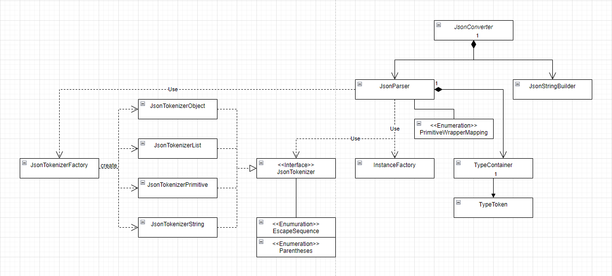

# JSON Converter

- **개요**
    - gson, jackson과 같은 java의 JSON라이브러리들은 어떻게 클래스의 필드명을 알고 변환을 진행하는 거지? 라는 의문에서 시작되었다.
    
- **목표**
    - Java객체를 JSON으로 변환하는 toJson() 메서드
    - JSON을 Java객체로 변환하는 fromJson() 메서드
    
- **상세**
    - 사용법
        - 업로드 된 jar파일을 내려받아 프로젝트에 연결한다.
        - 객체 생성
            - json_converter패키지의 JsonConverter를 import한 뒤 인스턴스를 생성한다.
                
                ```java
                JsonConverter jsonConverter = new JsonConverter();
                ```
                
        - toJson()
            - 생성한 JsonConverter의 toJson() 메서드에 변환하고 싶은 인스턴스를 인자로 전달하여 호출한다.
                
                ```java
                MyClass myClass = new MyClass();
                String str = jsonConverter.toJson(myClass);
                ```
                
        - fromJson()
            - JsonConverter 인스턴스의 fromJson() 메서드에 변환하고 싶은 JSON문자열과 Class정보를 인자로 전달한 뒤 호출한다.
                
                ```java
                String json = "{\"name\":\"John\"}";
                MyClass myClass = jsonConverter.fromJson(json, MyClass.class);
                ```
                
            - 변환하고 싶은 대상이 제네릭을 포함한 클래스라면 TypeToken을 상속받는 익명클래스 생성 후 인자로 전달한다.
                
                ```java
                String json = "[\"str1\", \"str2\"]";
                List<String> strList = jsonConverter
                		.fromJson(json, new TypeToken<List<String>>(){});
                ```
                
    
    - Class Diagram
    
    
    
    - JsonTokenizer
        - JSON문자열을 Java 객체로 변환하기 위해서는 먼저 JSON문자열에서 의미있는 토큰을 추출할 필요가 있었다. 예를 들어 다음과 같은 JSON문자열이 있다면
            
            ```java
            "{\"first\":1, \"second\":2}"
            ```
            
            의미있는 토큰은 “first”, 1, “second”, 2으로 4개가 될 것이다.
            
        - 배열. 객체, 문자열 또는 primitive일 경우 각각 추출하는 방법을 다르게 해야하였기 때문에 한 클래스에 모든 로직을 담으려하니 코드가 지저분해져서 팩토리 패턴을 적용하기로 하였다.
    
    - TypeToken
        - Java에서는 컴파일 시에 제네릭 타입 소거가 진행된다. 때문에 제네릭이 포함된 List<String>과 같은 클래스로 변환하는 데에 어려움이 있었다.
            
            ```java
            ~~List<String>.class~~ // 불가능(컴파일 에러)
            ~~new List<String>.getClass()~~ // 타입 소거 (타입을 가져오면 E가 반환됨)
            ```
            
        - Super Type Token
            - 이를 해결하기 위해 Super Type Token 기법이 사용되었다. 제네릭 파라미터를 갖는 TypeToken이라는 클래스를 정의한 뒤
            
            ```java
            public abstract class TypeToken<T> {
            	private Type type;
            	public TypeToken() {
                    Type superClass = getClass().getGenericSuperclass();
                    type = ((ParameterizedType) superClass).getActualTypeArguments()[0];
            	}
            
              public Type getType() { 
              	return type;
              } 
            }
            ```
            
            - 이를 상속받으면 런타임에서도 타입 정보를 지킬 수 있다. 익명 클래스를 통해 타입 소거를 교묘히 회피할 수 있는 것이다.
            
            ```java
            // java.util.List<java.lang.String>를 출력한다.
            System.out.print(
            	new TypeToken<List<String>>() {}.getType()
            );
            ```
            
            - 이렇게 얻어낸 타입 정보를 가지고 인스턴스 생성이 가능해졌다.
    
- **특징**
    - TDD (Test Driven Development)
        - 처음으로 TDD를 적용하여 진행한 프로젝트이다. 테스트 코드를 작성하며 프로젝트 진행함으로 인해 이후 코드가 바뀔 일이 있어도 테스트 실행을 통해 불안감 없는 코드 작성이 가능해졌다.
    - Git
        - 나름의 Commit 컨벤션을 정하여 GIt을 활용하며 프로젝트 진행하였다. 의미있는 단위마다 Commit을 진행해가며 프로젝트 진행하다보니 이후에 큰 실수가 있다고 하더라도 이전의 Commit 내역을 확인하여 시점을 돌려 다시 코드를 작성하는 등 더욱 안전한 진행과정이 되었다.

- **느낀점**
    - 0부터 시작하여 설계부터 코드 작성까지 모두 스스로 해야 했던 프로젝트였다. 객체지향적인 설계를 하기위해 애를 썼고 나름의 디자인 패턴을 적용해보기도 하였다.
    - 리플렉션, 제네릭 등 Java에 대해 아직 알아야할 것이 더 많이 있다는 것을 깨달았다. 진행 중 모르는 것을 알아가는 과정이 즐거운 프로젝트였다.
    - JSON 문법은 왜 그렇게 되어있는지, 기존 JSON라이브러리 메서드들의 사용 방법이 왜 그런 것인지 등에 대해 직접 프로젝트를 진행보면서 더욱 깊게 이해할 수 있었다.

- **아쉬웠던 점**
    - 예외 처리
        - 예외 처리가 제대로 되어있지 않다. 예를 들어 JSON문법을 틀렸다면 어느 부분이 틀렸는지 사용자에게 알려주어야 사용자 친화적인 프로그램일텐데 그런 부분이 많이 아쉽다. 이 부분은 지속적으로 수정할 예정이다.
    - 리팩토링
        - tokenizer는 꼭 팩토리 패턴을 적용해야 했을까? 하는 의문이 든다. 실제로 코드를 다시보면 tokenizer를 확장하는 클래스들끼리의 중복되는 부분이 많이 있다. 이후 더 좋은 방법을 고민하여 수정해야 겠다.
        - 한 메서드에 쌓여있는 수많은 if문과 else if문을 보면 한숨이 나온다. 더 깔끔한 코드를 만들 수 있도록 이후로도 지속적인 리팩토링이 필요해보인다.